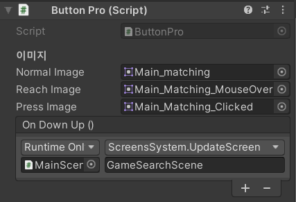

#ButtonPro
버튼 프로의 경우, 현재는 기능이 매우 적지만 계속 업데이트를 할 예정입니다.

메인 컴포넌트는 `ButtonPro`이며, 이 버튼들을 그룹화해주는 컴포넌트는 `Button Group`입니다.  

-----

  
Normal Image : 일반적인 평소 버튼 상태  
Reach Image : 마우스가 버튼에 닿았을 때 상태  
Press Image : 마우스가 버튼을 눌렀을 때 상태  

OnDownUp : 누르고 나서 땟을 시, 동작되는 이벤트

Button Pros : 그룹화가 되어야하는 `Button Pro` 입니다.   
Selected Number : 초기 선택되어야하는 Element Number 입니다. (기본 값 -1)